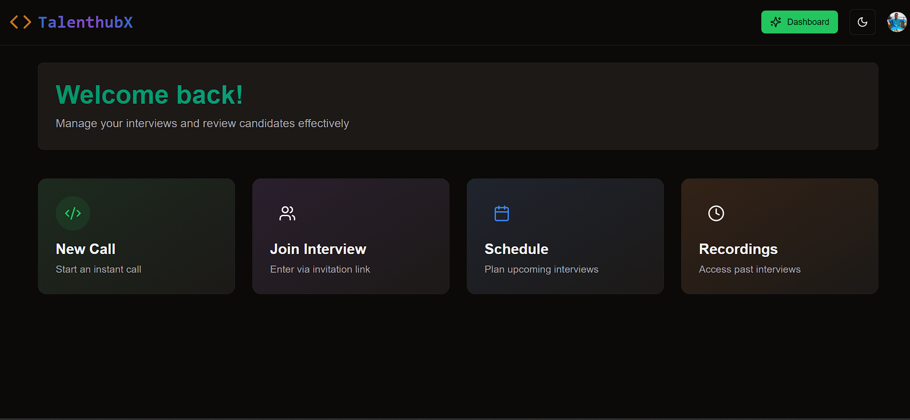

# 🎯 TalentHubX – The Ultimate Video Interview & Coding Platform  

## Overview
TalentHubX is a comprehensive video interview platform designed to streamline the hiring process with seamless video calling, scheduling,
and interview management. It includes an integrated code editor supporting multiple programming languages, enabling real-time coding assessments during interviews.

## 🚀 Features

### 🔹 New Call
- Interviewers can start a new interview session.
- Generates a unique interview link for participants.

### 🔹 Join Interview
- Candidates can join their scheduled interview via a provided link.
- Secure authentication ensures only authorized users can access the session.

### 🔹 Schedule Interview
- Interviewers can schedule upcoming interviews.
- Candidates can view their assigned interview schedules.

### 🔹 Interview Recordings
- Interviewers can access past interview recordings.
- Helps in reviewing candidate performance.

### 🎥 Live Interview Interface
The meeting page consists of three main sections:
- **📹 Video Call Section**: Controls for enabling/disabling video/audio.
- **💻 Coding Questions Section**: Displays real-time coding problems.
- **🖊️ Code Editor**: Supports multiple programming languages for live coding interviews.

## 🛠 Tech Stack
- **Frontend**: Next.js, TypeScript, ShadCN, Tailwind CSS
- **Database and Backend**: Convex
- **Authentication**: Clerk
- **Video Streaming**: GetStream UI

## 📸 Screenshots

